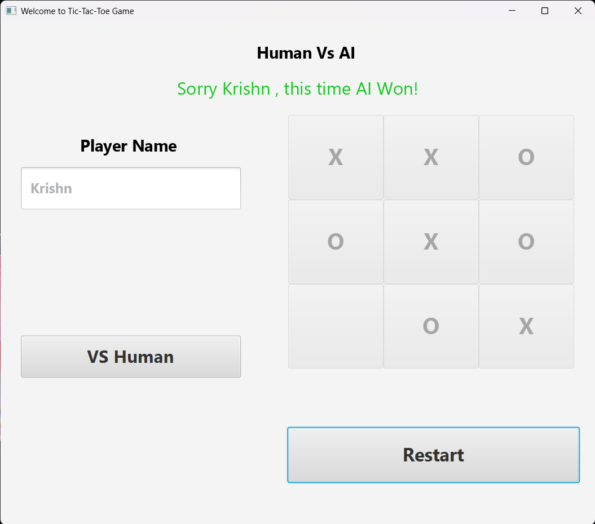
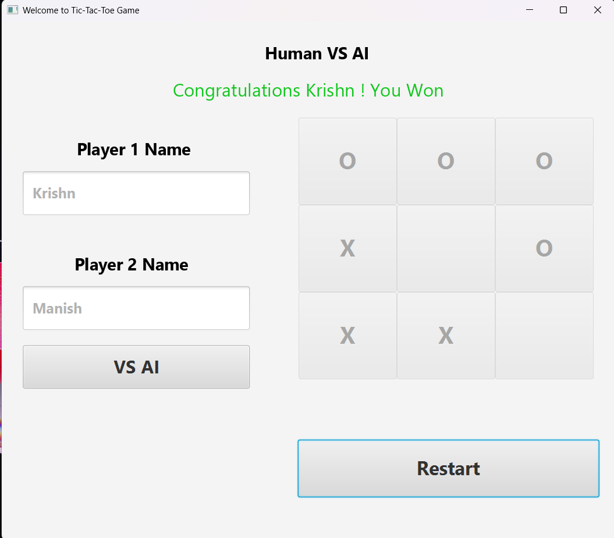

# 🎮 Tic Tac Toe (P v P OR P v AI)


> A classic and interactive **Tic Tac Toe Game** built using **JavaFX**.  
> Challenge a friend in **Player vs Player** mode or play against a smart **AI** opponent. Enjoy a clean interface, instant feedback, and game result tracking.


---


## 🖼️ Preview

| Player vs Player | Player vs AI |
|------------------|--------------|
|  |  |


---


## 🚀 Features

🧠 **Two Game Modes**  
- P v P (Player vs Player)  
- P v AI (Player vs Computer / AI)

🏆 **Win Tracking**  
- Automatically detects winner  
- Tracks score or game outcomes
- 
🎨 **JavaFX User Interface**  
- Clean and responsive layout  
- Instant button updates and turn indicators

🧩 **Smart AI Logic**  
- Basic AI to give human-like competition  
- Prevents easy win patterns

🔁 **Restart & Reset**  
- One-click restart for a new round  
- Reset scores (if tracking enabled)

---

## 🔧 Technologies Used

| Tech Stack | Description                           |
|------------|---------------------------------------|
| Java       | Core game logic                       |
| JavaFX     | GUI framework for Java                |
| FXML/CSS   | UI design and styling (optional)      |

---

## ⬇️ Download & Run

### 🔗 Clone the Repository

```bash
git clone https://github.com/manishrnl/tic-tac-toe-Game.git
cd tic-tac-toe-Game
```


---


## 🧭 Instructions

- Open project in IntelliJ or any Java IDE.

- Ensure JavaFX is properly configured in your IDE.

- Run the Main.java class or equivalent entry point.

- Start playing!

## 📌 Requirements
- ✅ Java 11+
- ✅ JavaFX SDK 17+
- ✅ IntelliJ IDEA IDE

---


## 📣 Future Enhancements
- 🎮 Add difficulty levels for AI
- 🌐 Multiplayer over LAN/WiFi
- 📊 Game statistics dashboard
- 🎨 Theme customization (board & symbols)

## 👨‍💻 Developed By
**Manish Kumar**
- 📧 manishrajrnl1@gmail.com
- 🔗 GitHub Profile


---


## 📂 Project Structure

```bash 
📁 tic-tac-toe-Game/
├── 📁 src/
│   ├── 📁 game/
│   ├── 📁 ai/
│   └── Main.java
├── 📁 resources/
│   ├── 📁 images/
│   └── 📄 styles.css
└── README.md


```
